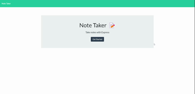

# Note Taker

## Description
This is a simple productivity app to take notes and save them in the cloud. 

## Table of Contents
* [Installation](#installation)
* [Usage](#usage)
* [License](#license)
* [Contributing](#contributing)
* [Tests](#tests)
* [Questions](#questions)

## Installation
Run `npm i` to install all necessary modules.

## Usage
This site is hosted on Heroku at [https://pacific-cove-62879.herokuapp.com/](https://pacific-cove-62879.herokuapp.com/). Once there, start typing a note. Click save to add it to the list on the left. Previous notes can be deleted as necessary.

A video showing functionality can be found [here](https://drive.google.com/file/d/1xxTqGKjgMbpfXkjCOa3i6CmE-ccN97fU/view).

## License
Licensed under the [MIT](https://opensource.org/licenses/MIT) license.

## Contributing
While I am not needing contributions at this time, I always welcome pointers on how to improve my code.

## Tests
Tests were run using the localhost at port 3001. Returns from the json file can be read there.

## Questions
If you have any questions on this application or wish to contribute, please contact me directly at dustinpezley@gmail.com.
You can view more of my work on my [GitHub profile](https://github.com/dustinpezley).
